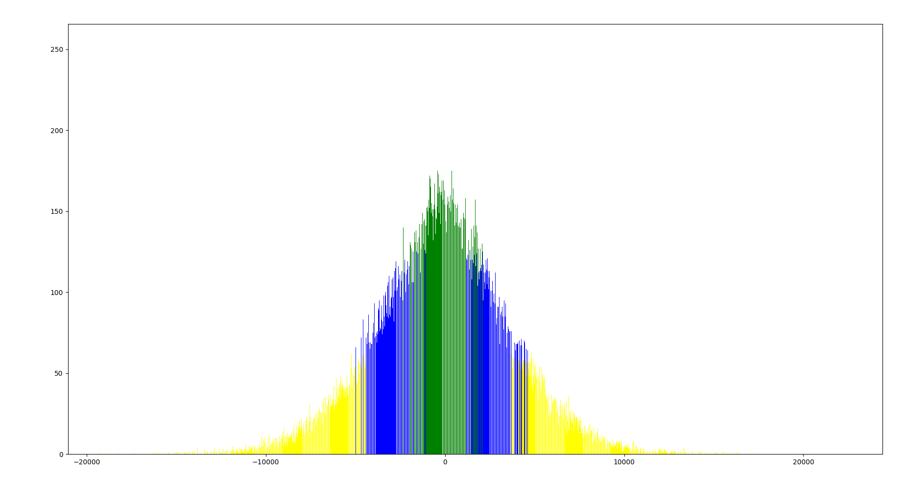
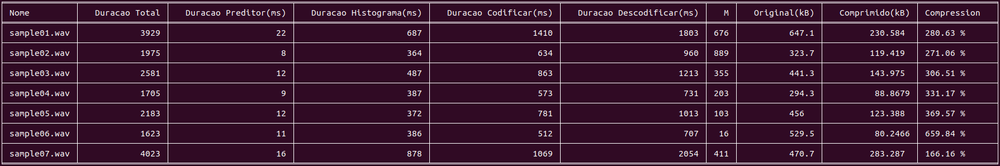
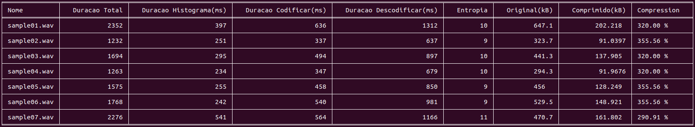

# IC_proj2

## Part A
### ex2
#### **Compile:**
```console 
g++ -g x.cpp -o x
```
#### **Execute:**
```console 
./x
```
### ex4
#### **Compile:**
```console 
g++ -g x.cpp -o x
```
#### **Execute:**
```console 
./x
```


## PartB

### Lossless
#### **Compile:** 
```console 
g++ -g losslessCodec_audio.cpp -o lossless -lsndfile && ./remove.sh 
```
#### **Execute:**
You need to pass as argument to the program the path to the wav song, in our case to test we 
are going to use `AudioSampleFiles/sample01.wav` as wav file
```console 
./lossless AudioSampleFiles/sample01.wav
```
### Lossy
#### **Compile:**
```console 
g++ -g lossyCodec_audio.cpp -o lossless -lsndfile && ./remove.sh 
```
#### **Execute:**
You need to pass as argument to the program the path to the wav song, in our case to test we
are going to use `AudioSampleFiles/sample01.wav` as wav file
```console 
./lossy AudioSampleFiles/sample01.wav
```
### Histograms
All the programs `./lossless` and `./lossy` calculate histograms and store them into a file 
called  `histMONO.txt` and in the lossless program it also creates a file called `histRESIDUAL.txt`.
To actually see the histograms you should run the following code in python
#### **Requirements:**
* Python3
  * matplotlib 
  * numpy
to install all the libraries necessary:  
```console 
pip3 install -r requirements.txt
```
#### **Run:**
    
```console 
python3 histogram.py [HISTOGRAM_FILE_PATH]
```
ex:
```console 
python3 histogram.py histMONO.txt
```


### More Information
All the programs `./lossless` and `./lossy` can show execution times and more info if you compile it 
with the tag `-D _TIMES` .
You can also generate tables with compiled information about the samples running the following scripts `./executer_lossless.sh`
or `./executer_lossy.sh`
#### **Requirements:**
* Python3
  * tabulate
    to install all the libraries necessary:
```console 
pip3 install -r requirements.txt
```
#### **Lossless Info:**
run the script:
```console 
./executer_lossless.sh
```
after script completition:
```console 
python3 tabels_lossless.py
```


#### **Lossy Info:**
run the script:
```console 
./executer_lossy.sh
```
after script completition:
```console 
python3 tabels.py
```



# Compilation arguments
To use compilation arguments these alguments should be after `-g` ex:
`g++ -g -D _TIMES -D _DEBUG lossyCodec_audio.cpp -o lossless -lsndfile`

* `-Wall` Show all warnings and errors
* `-D _DEBUG` Show Debug Prints
* `-D _TIMES` Calculate execution times

# Clean
You can clean all the repository just running 
```console 
./remove_all.sh
``` 